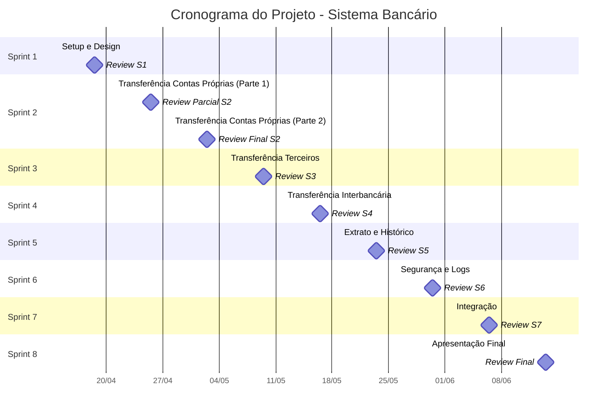

# Cronograma do Projeto - Sistema Bancário

| **Sprint** | **Data Início** | **Data Fim** | **Tarefas Principais** |
| --- | --- | --- | --- |
| Sprint 1: Setup e Design | 14/04/2025 | 18/04/2025 | Configuração do ambiente, design da interface, modelagem do banco de dados |
| Sprint 2: Transferência entre Contas Próprias | 21/04/2025 | 02/05/2025 | Implementação das funcionalidades de transferência entre contas do mesmo titular |
| Sprint 3: Transferência para Terceiros | 05/05/2025 | 09/05/2025 | Desenvolvimento do sistema de transferência para outras contas do banco |
| Sprint 4: Transferência Interbancária | 12/05/2025 | 16/05/2025 | Implementação de transferências entre bancos diferentes |
| Sprint 5: Extrato e Histórico | 19/05/2025 | 23/05/2025 | Desenvolvimento do sistema de extrato e histórico de transações |
| Sprint 6: Segurança e Logs | 26/05/2025 | 30/05/2025 | Implementação de sistemas de segurança e registro de operações |
| Sprint 7: Integração | 02/06/2025 | 06/06/2025 | Integração com outros módulos do sistema |
| Sprint 8: Apresentação Final | 09/06/2025 | 13/06/2025 | Preparação e realização da apresentação final |

Visualização do Cronograma:

<aside>
📅 Sprint Reviews acontecem todas as sextas-feiras 

</aside>

## Observações Importantes

- Cada Sprint tem duração de 5 dias úteis (segunda a sexta), exceto Sprint 2 que tem 10 dias úteis
- O projeto tem duração total de 9 semanas 
- Data de início das sprints: 14/04/2025
- Data de conclusão: 13/06/2025